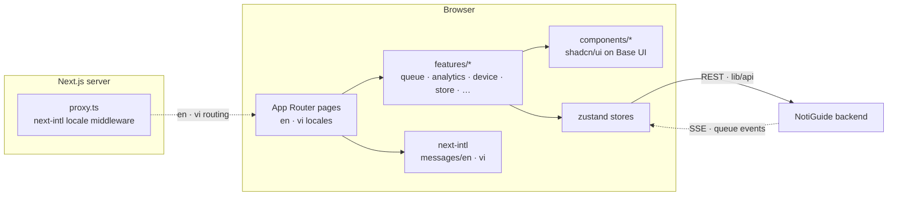

# NotiGuide — Admin Dashboard

The dashboard where store staff run the floor. Tickets stream in live; staff call the next customer, mark them served, or dispatch a physical pager — all from one queue board. Around it sit the management surfaces: organizations, stores, service types, admin accounts, device fleets, and an analytics view charting how the queues actually behave.

The whole UI ships in English and Vietnamese — not as an afterthought translation, but with copy written natively for each language — and respects light and dark themes throughout.

## Techstack

<p>
  <a href="https://nextjs.org/"></a>
  <a href="https://react.dev/"></a>
  <a href="https://www.typescriptlang.org/"></a>
  <a href="https://tailwindcss.com/"></a>
  <a href="https://ui.shadcn.com/"></a>
  <a href="https://biomejs.dev/"></a>
  <a href="https://vitest.dev/"></a>
  <a href="https://yarnpkg.com/"></a>
</p>

## The NotiGuide System

NotiGuide is an end-to-end queue management and notification system for stores — customers join a virtual queue from their phone, staff run the floor from a dashboard, and calls reach people through web push or dedicated RF pagers. This repository is that dashboard.

| Repository | Role |
|------------|------|
| [notiguide](https://github.com/Thomas-Hoang-04/notiguide) | Workspace superproject — system docs and submodule index |
| [notiguide-be](https://github.com/Thomas-Hoang-04/notiguide-be) | Reactive Kotlin/Spring Boot API — queue engine, auth, analytics, device orchestration |
| **notiguide-admin** (this repo) | Next.js dashboard for store staff — live queue control, dispatch, analytics |
| [notiguide-client](https://github.com/Thomas-Hoang-04/notiguide-client) | Next.js customer app — join queues, track position, receive web push |
| [notiguide-transmitter](https://github.com/Thomas-Hoang-04/notiguide-transmitter) | ESP32-C3 hub bridging MQTT dispatches to RF pager calls |
| [notiguide-receiver (`esp32`)](https://github.com/Thomas-Hoang-04/notiguide-receiver/tree/esp32) | ESP32-C3 pager — dual-radio (2.4 GHz nRF24 or 433 MHz OOK) |
| [notiguide-receiver (`esp8266`)](https://github.com/Thomas-Hoang-04/notiguide-receiver/tree/esp8266) | ESP8266 pager on the 433 MHz link |

## Features

- **Live queue board** — waiting and serving tickets update in real time over SSE; call, serve, and cancel without a refresh.
- **Pager dispatch** — pick a paired receiver right from the queue board and the call goes out over RF.
- **Analytics** — queue KPIs charted with Recharts, with date-range picking and skeleton loading states.
- **Fleet management** — enroll pager devices with one-time tokens and manage per-store rosters.
- **Org & store administration** — organizations, stores, custom public slugs, service types, admin accounts, and join requests.
- **Bilingual UI** — full English and Vietnamese coverage via next-intl, plus light/dark themes.

## Technical Highlights

- **Next.js 16 App Router with React 19** and the React Compiler enabled — no manual memoization.
- **shadcn/ui on Base UI primitives**, styled with Tailwind CSS 4; complex styles live in dedicated CSS files, not mile-long class strings.
- **Zustand stores** keep server state and UI state separated and testable.
- **Locale routing in middleware** — `src/proxy.ts` (Next.js middleware) drives next-intl's en/vi routing, while the `lib/` API layer talks to the backend with cookie-based auth and automatic token refresh.
- **Native-quality Vietnamese.** The `vi.json` catalog is written by hand to read like Vietnamese, not like translated English — structural parity with `en.json` is enforced, phrasing is not.
- **Vitest + Biome** — fast unit tests, single-tool lint and format.

## Architecture



## Screenshots

> 📷 *Live queue board with active tickets and dispatch controls — coming soon*
<!-- PHOTO: queue management page, tickets in waiting/serving columns -->

> 📷 *Analytics view with KPI charts — coming soon*
<!-- PHOTO: analytics page, charts with date range picker -->

> 📷 *Device fleet management — coming soon*
<!-- PHOTO: devices page with enrolled pagers and enrollment token dialog -->

## Getting Started

You need a recent Node.js LTS with Corepack (the repo pins Yarn 4) and a running [NotiGuide backend](https://github.com/Thomas-Hoang-04/notiguide-be). The backend URL defaults to `http://localhost:8080`; override it with `NEXT_PUBLIC_API_URL` in `.env.local`.

```bash
yarn install
yarn dev          # http://localhost:3000
yarn build        # production build
yarn lint         # biome check
yarn test         # vitest run
```

## Project Structure

```
src/
├── app/          — App Router routes and layouts
├── features/     — domain UI: queue, analytics, device, store, …
├── components/   — shared shadcn/ui components
├── store/        — zustand stores
├── hooks/ lib/   — shared hooks and utilities
├── i18n/ messages/ — next-intl setup + en/vi catalogs
├── styles/       — global and per-feature CSS
├── types/        — shared TypeScript types
└── proxy.ts      — Next.js middleware (next-intl locale routing)
```

---

_**Created by Minh Hai Hoang. June 2026**_
